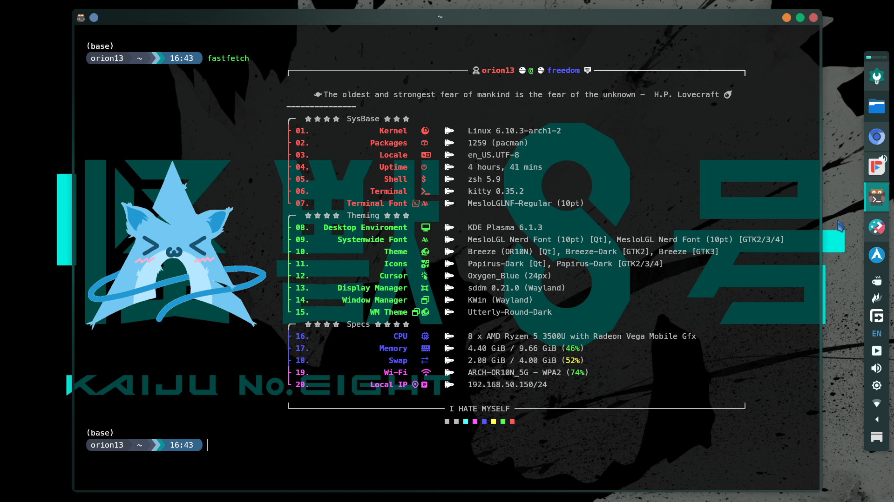
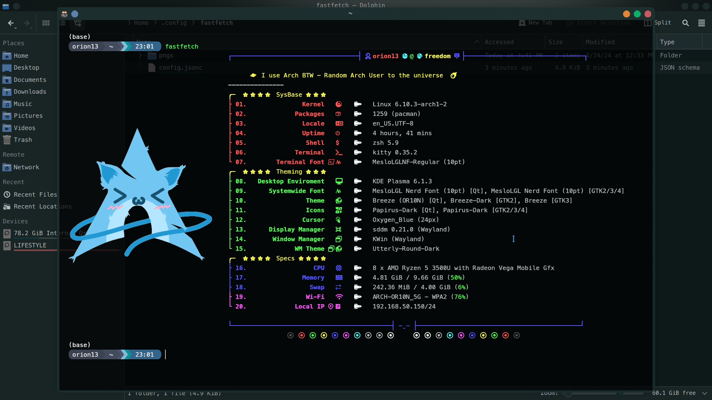
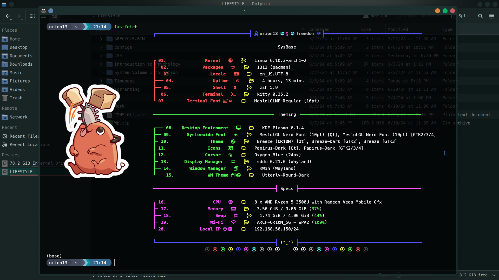

# galactic-fastfetch
A fastfetch theme for the lovers of Galactic Adventures.

## 📷 Previews

  
Preview Images 

 

 

 

 

 

# Steps for setting this fastfetch config :
1. Install 'fastfetch' in your machine / OS.
2. Generate config file by using command - $ fastfetch --gen-config
3. Install a Nerd Font and change the Terminal Font to the installed Nerd Font of your liking. I use Meslo.
4. Locate your fastfetch config folder (/home/USER/.config/fastfetch/) and copy the files of this repo into that folder. Replace the previous config.jsonc with mine.

# Changes to load Custom fastfetch theme :
1. Change the name of config_xx.jsonc to config.jsonc
2. Change the USER ("source": "$(find "/home/USER/.config/fastfetch/" -name "*.png" | sort -R | head -1)") of the config for pngs to work.

# Extra :
Change the Arch Linux logo with the distribution you are using
